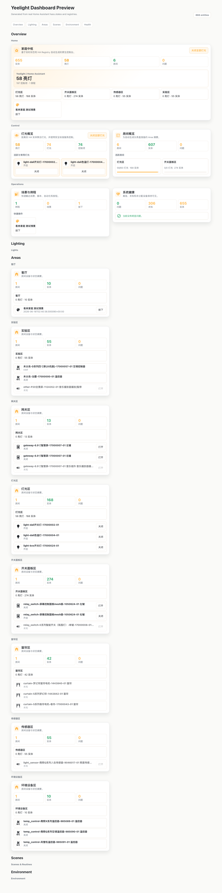

# Yeelight Dashboard

[English](README.md) | [中文](README_zh.md)

Yeelight Dashboard 是一个 Home Assistant Community Dashboard Strategy，用标准 HA registry 和 `hass.states` 自动生成完整的易来家庭中枢仪表盘。

它不是后端设备集成，不运行时依赖 `ha_yeelight_cards`，也不是旧版 Panel runtime 的原样搬运。



## 项目边界

| 项目 | 职责 |
| --- | --- |
| `ha_yeelight_pro` | 易来设备接入、HA 实体、服务和能力语义。 |
| `ha_yeelight_themes` | 易来视觉 token 和 HA 主题变量；推荐安装，但不是硬依赖。 |
| `ha_yeelight_cards` | 给手工配置 HA 仪表盘用户使用的轻量 Lovelace 卡片包。 |
| `ha_yeelight_dashboard` | 产品型自动生成仪表盘、Strategy Editor、Recipe、内部卡片和由旧版语义沉淀出的产品 subtype。 |

## 当前 MVP

- 注册 `ll-strategy-dashboard-yeelight-dashboard`。
- 注册 `window.customStrategies`，可被 HA 2026.5+ 的 Community dashboards 入口发现。
- 生成 Overview、Lighting、Areas、Scenes、Environment、Media、Health 的 HA `sections` 视图。
- 支持 `layout_mode: canvas`，通过 `custom:yeelight-dashboard-canvas-view` 承接自由布局；卡片仍由 Home Assistant 创建和维护，自定义视图根据卡片级 `view_layout` 排布，并提供可视拖拽和缩放控件。
- 通过标准 `hass.callWS` 读取 Area、Floor、Device、Entity、Label registry。
- 通过 `hass.states` 读取实时状态。
- 通过 `entityRegistry.platform === "yeelight_pro"` 或设备元数据识别易来实体，不使用中文名称关键词分类。
- 提供 `custom:yeelight-dashboard-hero-card`、`status-card`、`notice-card`、`light-card`、`rooms-card`、`room-card`、`devices-card`、`routines-card`、`environment-card`、`climate-card`、`air-card`、`water-card`、`power-card`、`energy-card`、`infrastructure-card`、`media-card`、`camera-card`、`camera-wall-card`、`security-card`、`presence-card`、`panel-actions-card`、`image-card`、`note-card`、`ecosystem-card`、`health-card` 等产品型复合卡片；这些卡片通过 `window.customCards` 注册 HA 可视化编辑器，支持接管后手工编辑，但定位仍是 Dashboard 产品卡，不替代轻量 `ha_yeelight_cards` 卡片包。
- 将旧版高价值卡片迁移为产品卡的 `subtype` 模式，而不是恢复旧 runtime。迁移范围包含中控主视觉、时间、每日提示、常用灯光、灯光状态、设备列表/单设备、快捷场景、脚本、自动化、天气、照度、更新、事件、历史等原核心卡模式，也包含媒体、摄像头、安防、人员存在、温控、空气、净水、电源、能源、基础设施、面板快捷操作、图片和便签类卡片家族。
- 每个已迁移的产品 subtype 都进入 HA 可视化卡片编辑器，提供本地化标签、推荐实体领域、分区尺寸、显示预设、HA 右侧卡片预览和紧凑分区尺寸预览。HA 原生媒体、摄像头、天气、传感器、区域、窗帘、扫地机、日历、待办、日志、地图、历史和能源能力仍按需要生成原生 Recipe。
- 旧版迁移盘点只作为迁移阶段输入使用，不再随包保留；当前覆盖通过 subtype 和 recipe 测试锁定。

## 安装

`ha_yeelight_dashboard` 是前端 Dashboard Strategy。安装资源后会注册 Strategy 和仪表盘卡片，但不会自动替用户创建一个仪表盘。资源加载后需要新建一次易来仪表盘；创建完成后，Strategy 会基于当前 Home Assistant registry 和 `hass.states` 自动生成视图与卡片。

### HACS 安装

[](https://my.home-assistant.io/redirect/hacs_repository/?owner=Yeelight&repository=ha_yeelight_dashboard&category=plugin)

1. 打开 HACS。
2. 将本仓库作为 **Dashboard** 或 **Plugin** 类型的自定义仓库添加，或在进入 HACS 目录后直接安装。
3. 安装 **Yeelight Dashboard**。
4. 刷新浏览器，让 Home Assistant 加载前端模块。

HACS 前端资源路径：

```yaml
url: /hacsfiles/ha_yeelight_dashboard/ha_yeelight_dashboard.js
type: module
```

手动安装资源路径：

```yaml
url: /local/ha_yeelight_dashboard.js
type: module
```

Home Assistant 2026.5+ 首次使用路径：

1. 通过 HACS 安装资源，或手动添加上面的前端资源。
2. 刷新浏览器，让 HA 加载该模块。
3. 进入仪表盘管理，新建仪表盘，在 `Community dashboards` 中选择 `Yeelight Dashboard`。
4. 在 Strategy Editor 中选择 profile、主题、实体范围、显示视图、区域选择，以及 `sections` 或 `canvas` 布局。

YAML 兜底方式：

```yaml
strategy:
  type: custom:yeelight-dashboard
```

可选 Canvas 布局模式：

```yaml
strategy:
  type: custom:yeelight-dashboard
  layout_mode: canvas
```

默认 `sections` 仪表盘使用 Home Assistant 原生的 Section 编辑、拖拽排序和卡片尺寸调整。若需要更接近旧版自由拖拽的能力，请使用 `layout_mode: canvas` 或 Panel profile。Managed Canvas 会保留 Strategy 自动生成能力，同时给每张生成卡片稳定 key、移动手柄、缩放手柄和 `x/y/w/h/z` 数值控件。Layout Studio 可以复制一段完整 JSON；在 Strategy Editor 中点击 `Import copied Canvas layout` 即可导入，也可以手工编辑 `layout_overrides`：

```json
{
  "layout_mode": "canvas",
  "layout_overrides": {
    "overview": {
      "overview.hero": { "x": 0, "y": 0, "w": 12, "h": 4 }
    }
  }
}
```

Home Assistant 2026.5+ 中，资源加载后也会在新建仪表盘的 Community dashboards 区域出现。

默认 profile 会使用 `ha_yeelight_themes` 提供的 `Yeelight Minimal` 主题。没有安装主题包时仪表盘仍可使用；Home Assistant 会回落到当前/默认主题变量，Strategy Editor 会在选中的易来主题不可用时显示提示。

## 开发

```bash
npm install
npm run lint
npm run test
npm run build
npm run test:browser
```

发布产物是 `dist/ha_yeelight_dashboard.js`。

推送 `v*` tag 后会由 `.github/workflows/release.yml` 自动发布。HACS release asset 必须保持命名为 `ha_yeelight_dashboard.js`。

可选的已登录真实 Home Assistant smoke：

```bash
HA_LIVE_URL=http://localhost:18124 \
HA_LIVE_STORAGE_STATE=/absolute/path/to/storage-state.json \
npm run test:live
```

或使用一次性登录账号：

```bash
HA_LIVE_URL=http://localhost:18124 \
HA_LIVE_USERNAME=your-user \
HA_LIVE_PASSWORD=your-password \
HA_LIVE_SCREENSHOT=output/playwright/ha-live-smoke.png \
npm run test:live
```

没有 `HA_LIVE_URL`，或同时缺少 `HA_LIVE_STORAGE_STATE` 与账号密码时，`test:live` 会按跳过处理。live smoke 只把当前构建产物注入已登录 HA 页面，并通过 `document.querySelector("home-assistant").hass` 调用 dashboard strategy；不会创建仪表盘、调用服务或写入 HA 配置。

如果已经把构建产物安装到 HA `/config/www/ha_yeelight_dashboard.js` 并注册为 Lovelace resource，可验证真实资源加载：

```bash
HA_LIVE_URL=http://localhost:18124 \
HA_LIVE_USERNAME=your-user \
HA_LIVE_PASSWORD=your-password \
npm run test:ha-resource
```

`test:ha-resource` 会校验 `/local/ha_yeelight_dashboard.js` 和本地 `dist/ha_yeelight_dashboard.js` 的 hash 一致，然后打开 Lovelace 仪表盘路径，等待 HA 自己加载资源后检查 `window.customStrategies`。默认路径是 `/lovelace`；如果你的仪表盘路径不同，可以设置 `HA_LIVE_DASHBOARD_PATH`。只打开 HA 2026 的 `/home` 新首页是不够的，因为那个页面不会加载 Lovelace resources。

两个 live smoke 默认都会等到 `hass.states` 至少有 1 个实体后再生成仪表盘。只有明确要测空态 fixture 时才设置 `HA_LIVE_MIN_STATES=0`；本地 HA 较慢时可以用 `HA_LIVE_TIMEOUT_MS` 调整浏览器导航等待，用 `HA_LIVE_RESOURCE_TIMEOUT_MS` 调整前置 `/local/...` 资源拉取超时。

## 许可证

MIT License
